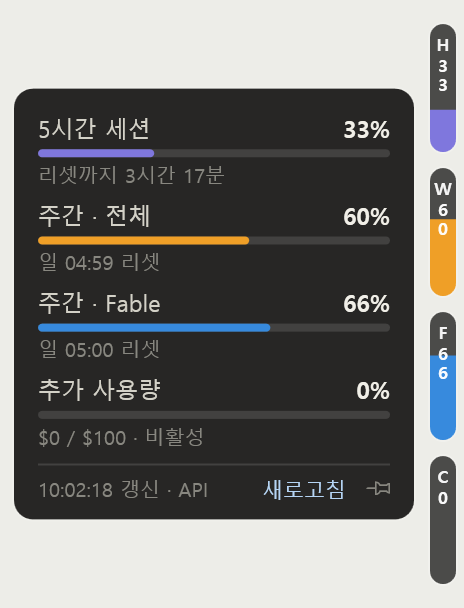

# Claude 사용량 사이드바

Claude Code 와 Codex 의 사용량 한도를 화면 오른쪽 가장자리에 폭 13px짜리 알약으로 표시하는 Windows 상주 프로그램.
둘 중 하나라도 켜면 자동으로 나타나고, 다 끄면 자동으로 사라진다.

| 평소 — 알약만 | 마우스를 올리면 — 상세 패널 |
|:--:|:--:|
|  |  |

표시 지표:

| 알약 | 제품 | 지표 |
|---|---|---|
| **CH** | Claude | 5시간 세션 한도 |
| **CW** | Claude | 주간 한도 (전체 모델) |
| **CF** | Claude | 주간 한도 (모델 전용 — Fable 등, 계정에 따라 뒷 글자가 바뀜) |
| **GH** | Codex | 5시간대 한도 |
| **GW** | Codex | 주간대 한도 |

앞 글자가 제품(C=Claude, G=GPT/Codex), 뒷 글자가 한도 종류다. Codex 쪽은 초록 계열 색으로도 구분된다. 계정마다 한도 구성이 달라서, 창 길이가 24시간 이하인 것들과
그보다 긴 것들로 나눈 뒤 각 무리에서 **가장 많이 쓴 한도**를 보여준다 — 먼저 막히는 쪽이 알고 싶은 값이다.
양쪽 크레딧은 알약 대신 상세 패널의 한 줄 텍스트로 나온다.

펼친 패널에서 지표 이름 왼쪽의 **체크칸**을 누르면 그 알약을 숨기거나 다시 꺼낼 수 있다(선택은 저장된다).
알약을 전부 끌 수는 없다 — 하나도 없으면 마우스를 올릴 곳이 없어 패널을 다시 열지 못한다.

알약에는 약자와 사용률 숫자가 세로로 표시되고, 사용률만큼 아래에서 색이 차오른다.
85%를 넘으면 빨간색으로 바뀌며 깜빡인다. 마우스를 올리면 왼쪽으로 상세 패널이 펼쳐져
리셋 시각과 마지막 갱신 시각을 보여준다.

## 설치

두 갈래가 있다. 어느 쪽이든 `%LOCALAPPDATA%\ClaudeSidebar\` 로 들어가고 Windows 시작 시 자동 실행까지 등록된다.

### 방법 1 — npx 한 줄

```bash
npx github:new-moon87/claude-usage-sidebar install
```

다시 실행:

```bash
npx github:new-moon87/claude-usage-sidebar start
```

제거:

```bash
npx github:new-moon87/claude-usage-sidebar uninstall
```

Node 가 없거나 zip 을 직접 받고 싶으면 [배포 사이트](https://claude-usage-sidebar.vercel.app)에서 내려받아 실행한다.

### 방법 2 — Claude 에 붙여넣기

아래를 Claude Code 에 그대로 붙여넣으면 런타임 확인부터 실행까지 알아서 한다.

```
Claude 사용량 사이드바를 이 PC에 설치해줘.

1. https://claude-usage-sidebar.vercel.app/version.json 을 받아 downloadUrl 과 sha256 을 확인한다.
2. `dotnet --list-runtimes` 로 Microsoft.WindowsDesktop.App 8.x 가 있는지 확인하고,
   없으면 `winget install Microsoft.DotNet.DesktopRuntime.8` 로 설치한다.
3. downloadUrl 의 zip 을 받아 sha256 을 대조한다. 값이 다르면 중단하고 알려준다.
4. ClaudeSidebar 프로세스가 실행 중이면 종료한다.
5. zip 을 %LOCALAPPDATA%\ClaudeSidebar\ 에 풀고 ClaudeSidebar.exe 를 실행한다.
6. 프로세스가 떠 있는지 확인하고 설치 결과를 알려준다.

설치 뒤에는 시작할 때 스스로 새 버전으로 갱신하므로 다시 설치할 필요는 없다.
```

## 요구 사항

1. **Windows** (WPF 앱이라 Windows 전용)
2. **.NET 8 Desktop Runtime** — 없으면 설치 명령을 안내한다.
   ```bash
   winget install Microsoft.DotNet.DesktopRuntime.8
   ```
3. **Claude Code** — 데스크톱 앱 또는 CLI. 자동 표시/숨김은 데스크톱 앱(`claude.exe`) 실행을 감지하는 방식이라,
   데스크톱 앱이 없으면 트레이 메뉴의 "항상 표시"를 켜서 쓴다.
4. **Claude Code 로그인 1회** — 아래 "데이터 출처" 참고.

## 데이터 출처

사용량은 두 경로에서 읽고, 앞쪽이 실패하면 뒤쪽으로 자동 폴백한다.

**1순위 — 사용량 API** (60초 주기)
`~/.claude/.credentials.json`의 OAuth 토큰으로 `GET https://api.anthropic.com/api/oauth/usage`를 호출한다.
네 지표 전부와 리셋 시각까지 나오는 완전한 경로다. 이 파일은 **Claude Code에 로그인해야 생긴다.**

토큰이 만료되면 리프레시 토큰으로 알아서 갱신하고, 원래 형식 그대로 원자적으로 되쓴다
(교체 직전 `.bak` 백업 생성, 다른 프로세스가 먼저 갱신했으면 파일 쪽을 우선). 액세스 토큰은 8시간,
리프레시 토큰은 30일이며 갱신할 때마다 30일이 다시 연장되므로, 이 앱을 계속 쓰면 재로그인할 일이 거의 없다.

로그인 기록이 없거나 리프레시 토큰까지 만료된 경우 패널에 "로그인 필요"가 표시되고,
그걸 클릭하거나 트레이 메뉴의 **"Claude 재로그인"** 을 누르면 터미널이 열려 로그인 절차가 시작된다.
CLI가 PATH에 없어도 데스크톱 앱에 내장된 엔진을 찾아 실행하므로, CLI를 따로 설치할 필요는 없다.

**2순위 — 데스크톱 앱 기록 파일** (폴백)
데스크톱 앱이 `%APPDATA%\Claude\plan-usage-history.json`에 5분 간격으로 남기는 기록을 읽는다.
API가 안 되는 상황에서도 H·W는 계속 보인다. 다만 이 파일에는 모델 전용 주간 한도가 없고,
추가 사용량은 간헐적으로만 기록되며, 리셋 시각 정보가 없다.

### Codex 쪽

Codex CLI 를 잠깐 띄워(`codex app-server`) 계정 한도를 한 줄 물어보고 바로 닫는다. **이 앱은 Codex 로그인
정보를 읽지도 고치지도 않는다.** 프로세스를 띄우는 값이라 10분에 한 번만 물어본다.

CLI 가 없거나 실패하면 `~/.codex/sessions/` 의 세션 기록으로 내려간다. 다만 그 기록에는 **그 요청에 걸린
한도 하나만** 들어 있어서, 특정 모델만 쓴 세션이면 계정 전체가 아니라 그 모델 한도(보통 0%)가 보인다.
그래서 폴백일 때는 어느 한도인지 이름을 패널에 같이 적는다.

## 조작

- **마우스 올림** — 상세 패널 펼침 / 벗어나면 접힘
- **핀 버튼** (패널 하단) — 펼친 상태로 고정 / 다시 누르면 해제
- **알약 드래그** — 위아래 위치 이동 (저장됨)
- **트레이 우클릭** — 지금 새로고침 · Claude 재로그인 · 항상 표시 · Windows 시작 시 실행 · 종료

수동 새로고침은 5초에 한 번으로 제한된다. API가 `429`를 반환하면 3분간 폴링을 멈추고 자동 복구한다.
사용량 API는 짧은 간격으로 반복 호출하면 한동안 전체를 차단하기 때문이다.

## 저장 위치

| 경로 | 내용 |
|---|---|
| `%LOCALAPPDATA%\ClaudeSidebar\` | 실행 파일 |
| `%APPDATA%\ClaudeSidebar\settings.json` | 위치·핀·자동 시작 설정 |
| `%APPDATA%\ClaudeSidebar\log.txt` | 동작 로그 (토큰은 절대 기록하지 않는다) |

## 직접 빌드

```bash
dotnet publish src/ClaudeSidebar/ClaudeSidebar.csproj -c Release -o dist
```

런타임 설치 없이 돌아가는 단일 실행 파일이 필요하면 (약 138MB):

```bash
dotnet publish src/ClaudeSidebar/ClaudeSidebar.csproj -c Release -r win-x64 --self-contained true -p:PublishSingleFile=true -p:IncludeNativeLibrariesForSelfExtract=true -o dist-standalone
```

## 주의

사용량 엔드포인트는 **공식 문서에 없는 비공식 API**이고, 데스크톱 앱의 기록 파일 형식도 언제든 바뀔 수 있다.
구조가 변경되면 해당 지표만 `-`로 표시되고 앱은 계속 동작하도록 관대하게 파싱하지만, 언젠가 깨질 수 있다는 전제로 쓰는 편이 좋다.

토큰은 메모리에만 두고 화면·로그에 출력하지 않으며, `api.anthropic.com`과 `console.anthropic.com` 외
어디로도 전송하지 않는다. 서명되지 않은 실행 파일이라 첫 실행 시 SmartScreen 경고가 뜨는데,
"추가 정보 → 실행"을 한 번 눌러 주면 된다.

설계 배경과 조사 기록은 [PLAN.md](PLAN.md), API 응답 구조는 [docs/usage-api-schema.md](docs/usage-api-schema.md) 참고.

## 라이선스

MIT
